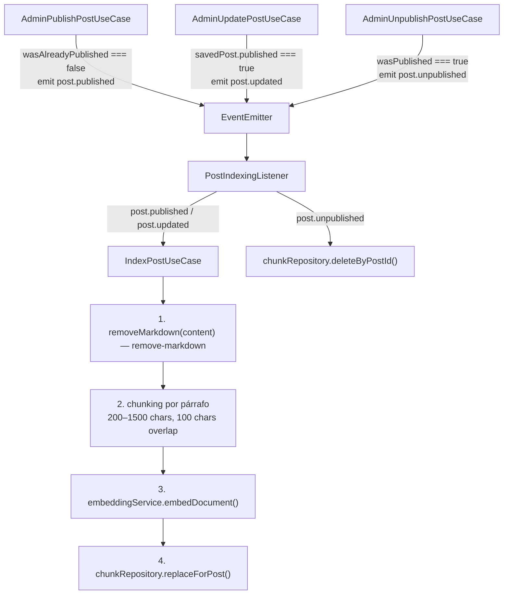

# Plan: Blog RAG con Búsqueda Híbrida (Semántica + FTS + RRF)

## Decisiones técnicas clave

- **Modelo Groq**: `openai/gpt-oss-20b` vía `groq-sdk`
- **Embeddings**: `@xenova/transformers` + `Xenova/bge-m3` (1024 dims, multilingüe, excelente en español)
- **pgvector**: Soporte nativo en TypeORM ^1.x — `@Column('vector', { dimensions: 1024 })`
- **Búsqueda**: HNSW (cosine) + GIN (tsvector) → RRF (k=60, 50 candidatos por pierna)
- **Indexación**: Auto vía `@nestjs/event-emitter`, eventual (asíncrona, no transaccional)
- **Top K**: 5 chunks por búsqueda (`RAG_TOP_K=5`)
- **Markdown stripping**: librería `remove-markdown` (conserva alt text de imágenes, elimina URLs)
- **Endpoint**: `POST /api/rag/ask` público, respuesta incluye `answer` + `sources[]`

## 1. Docker Compose

Cambiar imagen de `postgres:17.2` a `pgvector/pgvector:pg17` para incluir la extensión vector.

## 2. Migración — nueva (no modificar la baseline)

Crear la entidad `PostChunkTypeOrmEntity` primero. Luego:
1. Drop + recreate DB vacía
2. `pnpm migration:run` → baseline crea todas las tablas existentes
3. `pnpm migration:generate src/database/migrations/AddPostsChunks` → TypeORM detecta solo `posts_chunks`
4. Parchear el archivo generado manualmente:
   - Agregar `CREATE EXTENSION IF NOT EXISTS vector` como primera sentencia del `up`
   - Agregar índice `idx_chunks_post_id` e índice HNSW `idx_chunks_embedding` después del CREATE TABLE
   - Agregar `DROP EXTENSION IF EXISTS vector` al final del `down`
   - Agregar DROP INDEX antes del DROP TABLE en `down`

La baseline **no se toca**. La extensión vive en la nueva migración, antes de la tabla que la necesita.

### Tabla `posts_chunks`
```sql
CREATE TABLE posts_chunks (
  id           UUID          PRIMARY KEY,
  post_id      UUID          NOT NULL REFERENCES posts(id) ON DELETE CASCADE,
  chunk_index  INTEGER       NOT NULL,
  content      TEXT          NOT NULL,
  embedding    vector(1024)  NOT NULL,
  created_at   TIMESTAMP     NOT NULL DEFAULT now(),
  updated_at   TIMESTAMP     NOT NULL DEFAULT now()
);
CREATE INDEX idx_chunks_post_id ON posts_chunks(post_id);
CREATE INDEX idx_chunks_embedding ON posts_chunks
  USING hnsw (embedding vector_cosine_ops)
  WITH (m = 16, ef_construction = 64);
```

`ON DELETE CASCADE` asegura que al borrar un post, sus chunks se eliminan automáticamente sin listener.

## 3. Nuevas dependencias

```
groq-sdk
@xenova/transformers
@nestjs/event-emitter
remove-markdown          (+ @types/remove-markdown como devDependency)
```

## 4. Estructura del módulo `rag`

```
src/modules/rag/
  domain/
    entities/post-chunk.entity.ts
    repositories/post-chunk.repository.interface.ts
  application/
    use-cases/
      ask-blog/ask-blog.use-case.ts         ← búsqueda híbrida + LLM
      index-post/index-post.use-case.ts     ← chunk + embed + guardar
  infrastructure/
    persistence/
      typeorm/post-chunk.typeorm-entity.ts
      post-chunk.repository.impl.ts         ← raw SQL para vector ops + RRF
    http/
      dtos/request/ask-blog.request.dto.ts
      dtos/response/ask-blog.response.dto.ts
      rag.controller.ts
    embedding/embedding.service.ts          ← Xenova/bge-m3, lazy load
    llm/groq.service.ts                     ← openai/gpt-oss-20b + retry
    events/post-indexing.listener.ts        ← @OnEvent handlers
  rag.module.ts
```

## 5. Flujo de indexación (event-driven, eventual)



**Idempotencia de publicación**: `post.publish()` es idempotente (jsc en `post.entity.ts`), por eso se captura `wasAlreadyPublished = post.published` antes de llamarlo. El evento solo se emite si hubo transición draft→publicado.

**Sin transacción con la acción del post**: la indexación es eventual. Si falla, el post sigue publicado; el admin puede re-indexar. No se bloquea la respuesta del endpoint de publicación.

## 6. Búsqueda híbrida con RRF

Ejecutado en `PostChunkRepositoryImpl.hybridSearch()` vía `DataSource.query()`:

```sql
WITH
semantic AS (
  SELECT pc.id chunk_id, pc.post_id, pc.content,
    ROW_NUMBER() OVER (ORDER BY pc.embedding <=> $1::vector) rank
  FROM posts_chunks pc
  ORDER BY pc.embedding <=> $1::vector
  LIMIT 50
),
fts AS (
  SELECT pc.id chunk_id, pc.post_id, pc.content,
    ROW_NUMBER() OVER (
      ORDER BY ts_rank(p.search_vector, plainto_tsquery('spanish', $2)) DESC
    ) rank
  FROM posts_chunks pc
  JOIN posts p ON pc.post_id = p.id
  WHERE p.search_vector @@ plainto_tsquery('spanish', $2)
    AND p.published = true
  LIMIT 50
),
rrf AS (
  SELECT
    COALESCE(s.chunk_id, f.chunk_id) chunk_id,
    COALESCE(s.post_id,  f.post_id)  post_id,
    COALESCE(s.content,  f.content)  content,
    COALESCE(1.0/(60+s.rank), 0.0) + COALESCE(1.0/(60+f.rank), 0.0) rrf_score
  FROM semantic s FULL OUTER JOIN fts f ON s.chunk_id = f.chunk_id
)
SELECT r.chunk_id, r.post_id, r.content, r.rrf_score, p.title, p.slug
FROM rrf r
JOIN posts p ON r.post_id = p.id
WHERE p.published = true
ORDER BY r.rrf_score DESC
LIMIT $3
```

Parámetros: `$1` = vector (serializado como JSON string `[0.1, 0.2, ...]`), `$2` = query text, `$3` = topK (5).

## 7. AskBlogUseCase — lógica completa

```
1. embedQuery(query) → vector de 1024 dims (con prefijo BGE-M3)
2. hybridSearch(vector, query, topK=5) → IHybridSearchResult[]
3. Si results.length === 0 → retornar respuesta predefinida SIN llamar al LLM
4. Construir contexto numerado con título + contenido de cada chunk
5. System prompt: limitar al LLM a responder solo con el contexto
6. groqService.generateAnswer(systemPrompt, query + contexto)
7. Deduplicar fuentes por postId
8. Retornar { answer, sources: [{ title, slug }] }
```

**Sin coincidencias**: retornar `{ answer: 'No encontré información sobre ese tema en el blog. Prueba con otras palabras clave.', sources: [] }` directamente. Es UX, no un error; no se lanza excepción.

## 8. GroqService — retry para rate limit

```typescript
export const GROQ_MAX_RETRIES = 3;

// En generateAnswer():
for (let attempt = 1; attempt <= GROQ_MAX_RETRIES; attempt++) {
  try {
    return await this.client.chat.completions.create({ ... });
  } catch (error) {
    if (error?.status === 429 && attempt < GROQ_MAX_RETRIES) {
      const waitSecs = parseInt(error.headers?.['retry-after'] ?? String(attempt * 5));
      await new Promise(r => setTimeout(r, waitSecs * 1000));
      continue;
    }
    if (attempt === GROQ_MAX_RETRIES) {
      throw new ServiceUnavailableException('El servicio de IA no está disponible en este momento');
    }
    throw error; // errores no-429: re-lanzar inmediatamente
  }
}
```

## 9. EmbeddingService — lazy loading y prefijo BGE-M3

```typescript
// Prefijo obligatorio para queries (no para chunks):
const QUERY_PREFIX = 'Represent this sentence for searching relevant passages: ';

async embedQuery(query: string): Promise<number[]> {
  return this.embedDocument(QUERY_PREFIX + query);
}
```

El pipeline se inicializa en `onModuleInit()`. Primera carga descarga ~570MB, se cachea automáticamente.

## 10. Wiring de módulos

- `AppModule`: `EventEmitterModule.forRoot({ wildcard: false })` antes de `DatabaseModule`; `RagModule` después de `BlogModule`
- `RagModule`: importa `BlogModule` (para acceder a `POST_REPOSITORY` y `PostTypeOrmEntity`)
- `BlogModule`: ya exporta `POST_REPOSITORY` y `TypeOrmModule` — no requiere cambios en el módulo

## 11. Cursor Rule — `.cursor/rules/rag.mdc`

`globs: src/modules/rag/**` — cubre convenciones de: chunking, embedding (prefijo de query), LLM (solo via GroqService), hybrid search (solo via repositorio), eventos (patrón `post.<acción>`, idempotencia en publish), no-match sin LLM, mapeo de errores.

## 12. Unit Tests

### `embedding.service.spec.ts`
- `jest.mock('@xenova/transformers')` con factory
- Init del pipeline con modelo correcto
- Embed de chunk sin prefijo
- Embed de query con prefijo BGE-M3
- `ServiceUnavailableException` si pipeline no inicializado

### `groq.service.spec.ts`
- `jest.mock('groq-sdk')` con factory
- Llamada correcta al modelo con parámetros exactos
- Retry exitoso en 429 (2 intentos)
- `ServiceUnavailableException` tras `GROQ_MAX_RETRIES` fallos
- Re-lanzamiento inmediato de errores no-429

### `index-post.use-case.spec.ts`
- Flujo happy path: strip + chunk + embed + replaceForPost
- Strip de Markdown verificado (sin `#`, `**`, ``)
- Contenido corto → 1 chunk
- Post no encontrado → log + return sin error
- Re-throw de error del repositorio

### `ask-blog.use-case.spec.ts`
- Flujo happy path: embed query + search + LLM + answer + sources deduplicados
- Sin resultados → respuesta predefinida, LLM NO llamado
- `ServiceUnavailableException` de GroqService propagada sin envolver

## 13. Actualización de README.md

- **Requisitos**: PostgreSQL → `pgvector/pgvector:pg17` vía Docker
- **Stack**: agregar `Xenova/bge-m3` y `Groq openai/gpt-oss-20b`
- **Variables de entorno**: agregar `GROQ_API_KEY` y `RAG_TOP_K`
- **Nueva sección "Asistente del Blog (RAG)"**: endpoint, body, respuesta, flujo de indexación automática

## Variables de entorno necesarias

```env
# RAG / AI
GROQ_API_KEY=gsk_...        # obligatoria
RAG_TOP_K=5                 # chunks retornados (default: 5)
RAG_CANDIDATE_LIMIT=50      # candidatos por pierna RRF (documentar, hardcodeado en SQL)
```
